Lab 02 - Plastic waste
================
Eric Stone
1.8.24

## Load packages and data

``` r
library(tidyverse) 
```

``` r
plastic_waste <- read.csv("data/plastic-waste.csv")
```

## Exercises

### Exercise 1

This was interesting to play around with. You can see my various
attempts at visualization below. It turned out to be most effective to
take Trinidad and Tobago out. In general, Europe and North America seem
to have the most waste. Africa has the least. I expect that this is
mostly a function of how developed the nations are.

``` r
ggplot(data = plastic_waste, aes(x = plastic_waste_per_cap)) +
  geom_histogram(binwidth = 0.2)
```

    ## Warning: Removed 51 rows containing non-finite values (`stat_bin()`).

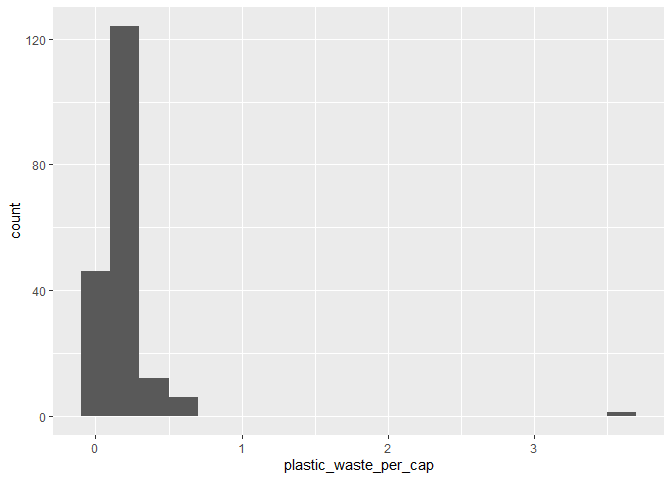<!-- -->

``` r
plastic_waste %>%
  filter(plastic_waste_per_cap > 3.5)
```

    ##   code              entity     continent year gdp_per_cap plastic_waste_per_cap
    ## 1  TTO Trinidad and Tobago North America 2010    31260.91                   3.6
    ##   mismanaged_plastic_waste_per_cap mismanaged_plastic_waste coastal_pop
    ## 1                             0.19                    94066     1358433
    ##   total_pop
    ## 1   1341465

``` r
ggplot(data = plastic_waste, aes(x = plastic_waste_per_cap)) +
  geom_histogram(binwidth = 0.2)+
  facet_grid(~ continent)
```

    ## Warning: Removed 51 rows containing non-finite values (`stat_bin()`).

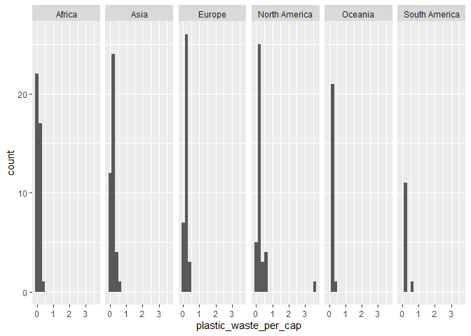<!-- -->

``` r
ggplot(data = plastic_waste, aes(x = plastic_waste_per_cap)) +
  geom_histogram(binwidth = 0.8)+
  facet_grid(~ continent)
```

    ## Warning: Removed 51 rows containing non-finite values (`stat_bin()`).

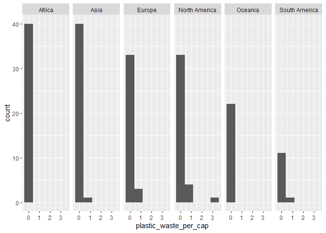<!-- -->

``` r
ggplot(data = plastic_waste, aes(x = plastic_waste_per_cap)) +
  geom_histogram(binwidth = 0.1)+
  facet_grid(~ continent)
```

    ## Warning: Removed 51 rows containing non-finite values (`stat_bin()`).

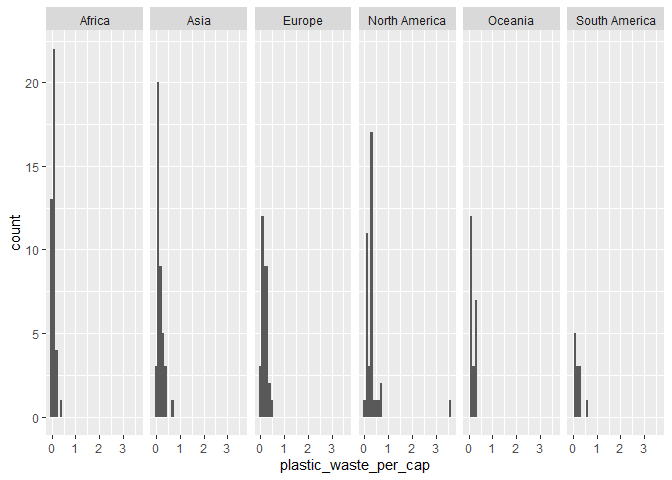<!-- -->

``` r
ggplot(data = plastic_waste, aes(x = plastic_waste_per_cap)) +
  geom_histogram(binwidth = 0.1)+
  facet_wrap(~ continent, ncol = 2)
```

    ## Warning: Removed 51 rows containing non-finite values (`stat_bin()`).

<!-- -->

``` r
ggplot(data = plastic_waste %>%
  filter(plastic_waste_per_cap < 3.5), aes(x = plastic_waste_per_cap)) +
  geom_histogram(binwidth = 0.1)+
  facet_wrap(~ continent, ncol = 1) 
```

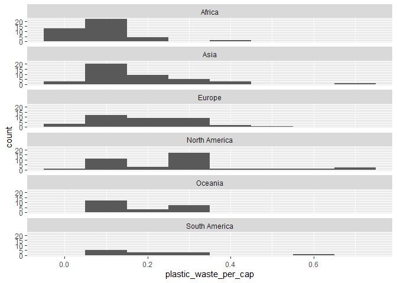<!-- -->

``` r
ggplot(data = plastic_waste %>%
  filter(plastic_waste_per_cap < 3.5), aes(x = plastic_waste_per_cap)) +
  geom_histogram(binwidth = 0.1)+
  facet_wrap(~ continent, ncol = 2) 
```

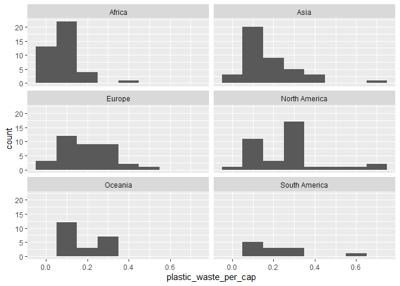<!-- -->

### Exercise 2

Describe why we defined the color and fill of the curves by mapping
aesthetics of the plot but we defined the alpha level as a
characteristic of the plotting geom.

I believe this is a mapping vs. setting issue. “color” and “fill” were
based on the continent variable, but alpha was chosen by us, not based
on any particular variable. Note this isn’t a function of, for example,
color vs. alpha, but instead with what we were using these for in this
particular case.

``` r
ggplot(data = plastic_waste,
       aes(x = plastic_waste_per_cap)) +
  geom_density()
```

    ## Warning: Removed 51 rows containing non-finite values (`stat_density()`).

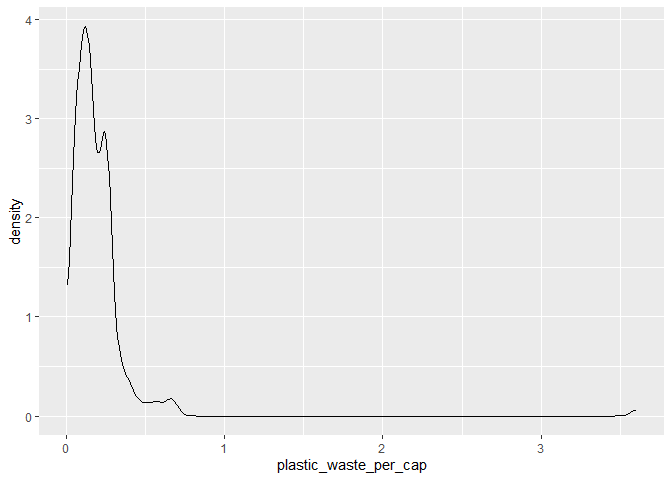<!-- -->

``` r
ggplot(data = plastic_waste, 
       mapping = aes(x = plastic_waste_per_cap, 
                     color = continent)) +
  geom_density()
```

    ## Warning: Removed 51 rows containing non-finite values (`stat_density()`).

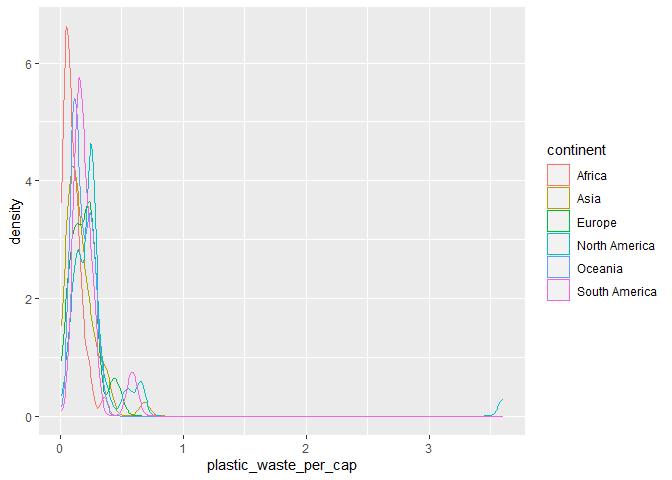<!-- -->

``` r
ggplot(data = plastic_waste, 
       mapping = aes(x = plastic_waste_per_cap, 
                     color = continent, 
                     fill = continent)) +
  geom_density()
```

    ## Warning: Removed 51 rows containing non-finite values (`stat_density()`).

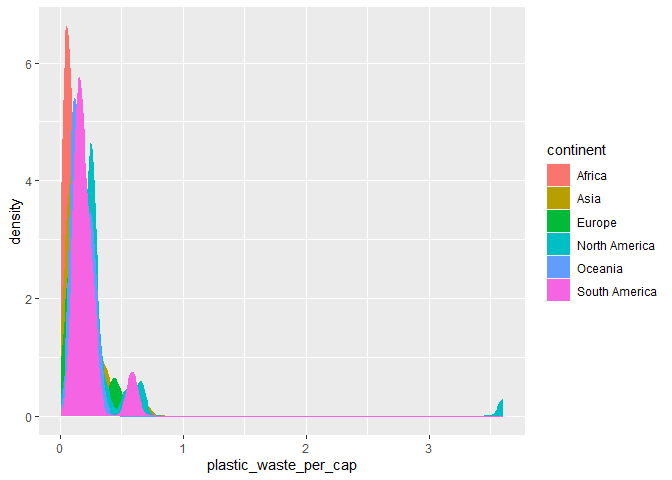<!-- -->

``` r
ggplot(data = plastic_waste, 
       mapping = aes(x = plastic_waste_per_cap, 
                     color = continent, 
                     fill = continent)) +
  geom_density(alpha = 0.7)
```

    ## Warning: Removed 51 rows containing non-finite values (`stat_density()`).

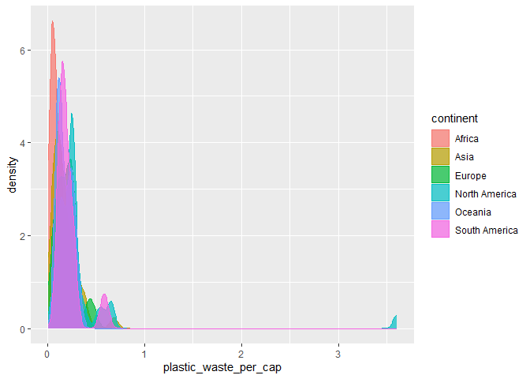<!-- -->

``` r
ggplot(data = plastic_waste, 
       mapping = aes(x = plastic_waste_per_cap, 
                     color = continent, 
                     fill = continent)) +
  geom_density(alpha = 0.2)
```

    ## Warning: Removed 51 rows containing non-finite values (`stat_density()`).

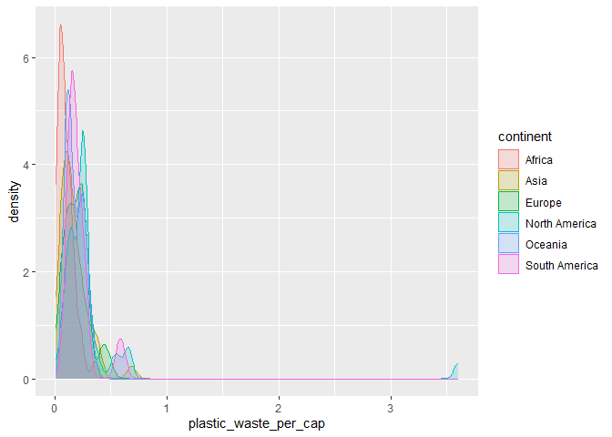<!-- -->

``` r
ggplot(data = plastic_waste, 
       mapping = aes(x = plastic_waste_per_cap, 
                     color = continent, 
                     fill = continent)) +
  geom_density(alpha = 0.05)
```

    ## Warning: Removed 51 rows containing non-finite values (`stat_density()`).

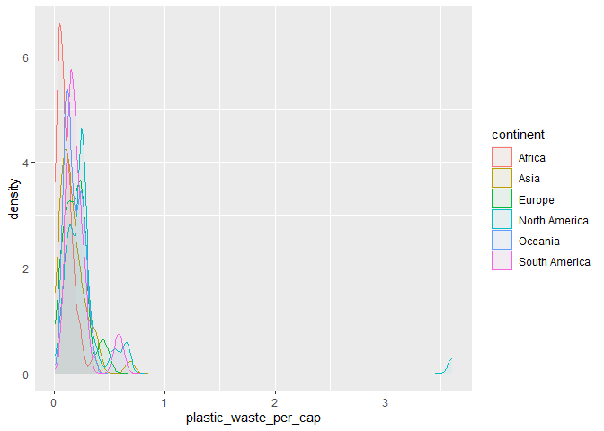<!-- -->

### Exercise 3

Remove this text, and add your answer for Exercise 3 here.

### Exercise 4

Remove this text, and add your answer for Exercise 4 here.

``` r
# insert code here
```

### Exercise 5

Remove this text, and add your answer for Exercise 5 here.

``` r
# insert code here
```

### Exercise 6

Remove this text, and add your answer for Exercise 6 here.

``` r
# insert code here
```

### Exercise 7

Remove this text, and add your answer for Exercise 7 here.

``` r
# insert code here
```

``` r
# insert code here
```

### Exercise 8

Remove this text, and add your answer for Exercise 8 here.

``` r
# insert code here
```
