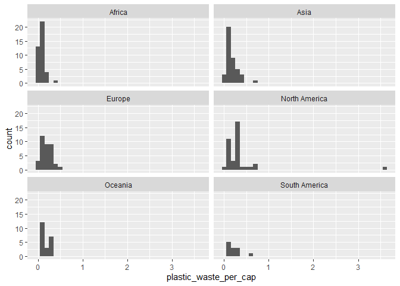

Lab 02 - Plastic waste
================
Eric Stone
1.8.24

## Load packages and data

``` r
library(tidyverse) 
```

``` r
plastic_waste <- read.csv("data/plastic-waste.csv")
```

## Exercises

### Exercise 1

This was interesting to play around with. You can see my various
attempts at visualization below. It turned out to be most effective to
take Trinidad and Tobago out. In general, Europe and North America seem
to have the most waste. Africa has the least. I expect that this is
mostly a function of how developed the nations are.

``` r
ggplot(data = plastic_waste, aes(x = plastic_waste_per_cap)) +
  geom_histogram(binwidth = 0.2)
```

    ## Warning: Removed 51 rows containing non-finite values (`stat_bin()`).

<!-- -->

``` r
plastic_waste %>%
  filter(plastic_waste_per_cap > 3.5)
```

    ##   code              entity     continent year gdp_per_cap plastic_waste_per_cap
    ## 1  TTO Trinidad and Tobago North America 2010    31260.91                   3.6
    ##   mismanaged_plastic_waste_per_cap mismanaged_plastic_waste coastal_pop
    ## 1                             0.19                    94066     1358433
    ##   total_pop
    ## 1   1341465

``` r
ggplot(data = plastic_waste, aes(x = plastic_waste_per_cap)) +
  geom_histogram(binwidth = 0.2)+
  facet_grid(~ continent)
```

    ## Warning: Removed 51 rows containing non-finite values (`stat_bin()`).

<!-- -->

``` r
ggplot(data = plastic_waste, aes(x = plastic_waste_per_cap)) +
  geom_histogram(binwidth = 0.8)+
  facet_grid(~ continent)
```

    ## Warning: Removed 51 rows containing non-finite values (`stat_bin()`).

<!-- -->

``` r
ggplot(data = plastic_waste, aes(x = plastic_waste_per_cap)) +
  geom_histogram(binwidth = 0.1)+
  facet_grid(~ continent)
```

    ## Warning: Removed 51 rows containing non-finite values (`stat_bin()`).

<!-- -->

``` r
ggplot(data = plastic_waste, aes(x = plastic_waste_per_cap)) +
  geom_histogram(binwidth = 0.1)+
  facet_wrap(~ continent, ncol = 2)
```

    ## Warning: Removed 51 rows containing non-finite values (`stat_bin()`).

<!-- -->

``` r
ggplot(data = plastic_waste %>%
  filter(plastic_waste_per_cap < 3.5), aes(x = plastic_waste_per_cap)) +
  geom_histogram(binwidth = 0.1)+
  facet_wrap(~ continent, ncol = 1) 
```

<!-- -->

``` r
ggplot(data = plastic_waste %>%
  filter(plastic_waste_per_cap < 3.5), aes(x = plastic_waste_per_cap)) +
  geom_histogram(binwidth = 0.1)+
  facet_wrap(~ continent, ncol = 2) 
```

<!-- -->

### Exercise 2

Describe why we defined the color and fill of the curves by mapping
aesthetics of the plot but we defined the alpha level as a
characteristic of the plotting geom.

I believe this is a mapping vs. setting issue. “color” and “fill” were
based on the continent variable, but alpha was chosen by us, not based
on any particular variable. Note this isn’t a function of, for example,
color vs. alpha, but instead with what we were using these for in this
particular case.

``` r
ggplot(data = plastic_waste,
       aes(x = plastic_waste_per_cap)) +
  geom_density()
```

    ## Warning: Removed 51 rows containing non-finite values (`stat_density()`).

<!-- -->

``` r
ggplot(data = plastic_waste, 
       mapping = aes(x = plastic_waste_per_cap, 
                     color = continent)) +
  geom_density()
```

    ## Warning: Removed 51 rows containing non-finite values (`stat_density()`).

<!-- -->

``` r
ggplot(data = plastic_waste, 
       mapping = aes(x = plastic_waste_per_cap, 
                     color = continent, 
                     fill = continent)) +
  geom_density()
```

    ## Warning: Removed 51 rows containing non-finite values (`stat_density()`).

<!-- -->

``` r
ggplot(data = plastic_waste, 
       mapping = aes(x = plastic_waste_per_cap, 
                     color = continent, 
                     fill = continent)) +
  geom_density(alpha = 0.7)
```

    ## Warning: Removed 51 rows containing non-finite values (`stat_density()`).

<!-- -->

``` r
ggplot(data = plastic_waste, 
       mapping = aes(x = plastic_waste_per_cap, 
                     color = continent, 
                     fill = continent)) +
  geom_density(alpha = 0.2)
```

    ## Warning: Removed 51 rows containing non-finite values (`stat_density()`).

<!-- -->

``` r
ggplot(data = plastic_waste, 
       mapping = aes(x = plastic_waste_per_cap, 
                     color = continent, 
                     fill = continent)) +
  geom_density(alpha = 0.05)
```

    ## Warning: Removed 51 rows containing non-finite values (`stat_density()`).

<!-- -->

### Exercise 3

What do the violin plots reveal that box plots do not? What features are
apparent in the box plots but not in the violin plots?

At least given these defaults, box plots provide more summary statistics
(like (I think) the 25% and 75% quartiles) than the violin plots do.
They also seem to convey the outliers more clearly. I believe violin
plots are used when one wants to have a pretty presentation, but doesn’t
really care about communicating information. :)

``` r
ggplot(data = plastic_waste, 
       mapping = aes(x = continent, 
                     y = plastic_waste_per_cap)) +
  geom_boxplot()
```

    ## Warning: Removed 51 rows containing non-finite values (`stat_boxplot()`).

<!-- -->

``` r
ggplot(data = plastic_waste, 
       mapping = aes(x = continent, 
                     y = plastic_waste_per_cap)) +
  geom_violin()
```

    ## Warning: Removed 51 rows containing non-finite values (`stat_ydensity()`).

<!-- -->

### Exercise 4

4.1. Visualize the relationship between plastic waste per capita and
mismanaged plastic waste per capita using a scatterplot. Describe the
relationship.

In general, as the amount of plastic waste per capita increases, the
amount of mismanaged plastic waste per capita increases as well. It
seems to be a moderately strong relationship.

4.2. Color the points in the scatterplot by continent. Does there seem
to be any clear distinctions between continents with respect to how
plastic waste per capita and mismanaged plastic waste per capita are
associated?

I was having trouble seeing this with the graphs overlayed, so I faceted
by continent and then eliminated T+T from the graph. The relationship
seems particularly strong in Africa, Oceania, and (to a somewhat lesser
extent) Asia. Interestingly, there doesn’t seem to be any relationship
in Europe and at most a small relationship in North America. I expect
the lack of relationship in Europe is because most of the countries are
developed there.

4.3. Visualize the relationship between plastic waste per capita and
total population as well as plastic waste per capita and coastal
population. You will need to make two separate plots. Do either of these
pairs of variables appear to be more strongly linearly associated?

There seems to be a small to moderate negative relationship in both
cases. Maybe it’s slightly greater with coastal population, but it
doesn’t seem that different to me. Note to visualize what was going on,
I again took T+T out.

``` r
ggplot(data = plastic_waste, mapping = aes(x = plastic_waste_per_cap, y = mismanaged_plastic_waste_per_cap)) +
  geom_point() +
  labs(title = "Plastic waste per capita vs. Mismanaged plastic waste per capita",
       x = "Plastic waste", y = "Mismanaged plastic waste")
```

    ## Warning: Removed 51 rows containing missing values (`geom_point()`).

<!-- -->

``` r
ggplot(data = plastic_waste, mapping = aes(x = plastic_waste_per_cap, y = mismanaged_plastic_waste_per_cap, color = continent)) +
  geom_point() +
  labs(title = "Plastic waste per capita vs. Mismanaged plastic waste per capita, per continent",
       x = "Plastic waste", y = "Mismanaged plastic waste")
```

    ## Warning: Removed 51 rows containing missing values (`geom_point()`).

<!-- -->

``` r
ggplot(data = plastic_waste, mapping = aes(x = plastic_waste_per_cap, y = mismanaged_plastic_waste_per_cap, color = continent)) +
  geom_point() + 
  facet_wrap(~ continent, ncol = 2) +
  labs(title = "Plastic waste per capita vs. Mismanaged plastic waste per capita, per continent",
       x = "Plastic waste", y = "Mismanaged plastic waste")
```

    ## Warning: Removed 51 rows containing missing values (`geom_point()`).

<!-- -->

``` r
ggplot(data = plastic_waste %>%
  filter(plastic_waste_per_cap < 3.5), mapping = aes(x = plastic_waste_per_cap, y = mismanaged_plastic_waste_per_cap, color = continent)) +
  geom_point() + 
  facet_wrap(~ continent, ncol = 2) +
  labs(title = "Plastic waste per capita vs. Mismanaged plastic waste per capita, per continent",
       x = "Plastic waste", y = "Mismanaged plastic waste")
```

<!-- -->

``` r
ggplot(data = plastic_waste, mapping = aes(x = plastic_waste_per_cap, y = total_pop)) +
  geom_point() +
  labs(title = "Plastic waste per capita vs. Total Population",
       x = "Plastic waste", y = "Total population")
```

    ## Warning: Removed 61 rows containing missing values (`geom_point()`).

<!-- -->

``` r
ggplot(data = plastic_waste, mapping = aes(x = plastic_waste_per_cap, y = coastal_pop)) +
  geom_point() +
  labs(title = "Plastic waste per capita vs. Coastal population",
       x = "Plastic waste", y = "Coastal population")
```

    ## Warning: Removed 51 rows containing missing values (`geom_point()`).

<!-- -->

``` r
ggplot(data = plastic_waste %>%
  filter(plastic_waste_per_cap < 3.5), mapping = aes(x = plastic_waste_per_cap, y = total_pop)) +
  geom_point() +
  labs(title = "Plastic waste per capita vs. Total Population",
       x = "Plastic waste", y = "Total population")
```

    ## Warning: Removed 10 rows containing missing values (`geom_point()`).

<!-- -->

``` r
ggplot(data = plastic_waste %>%
  filter(plastic_waste_per_cap < 3.5), mapping = aes(x = plastic_waste_per_cap, y = coastal_pop)) +
  geom_point() +
  labs(title = "Plastic waste per capita vs. Coastal population",
       x = "Plastic waste", y = "Coastal population")
```

<!-- -->

### Exercise 5

Note I had trouble specifying the dataset for the analysis. I saw the
“attach” command on-line. Is there a better way to do this?

``` r
attach(plastic_waste)
perc_coastal <- coastal_pop / total_pop 
ggplot(data = plastic_waste %>%
  filter(plastic_waste_per_cap < 3.5), mapping = aes(x = coastal_pop, y = plastic_waste_per_cap)) +
  geom_point() +
  labs(title = "Coastal population percentage vs. Plastic waste per capita",
       x = "Coastal population percentage", y = "Plastic waste")
```

<!-- -->
