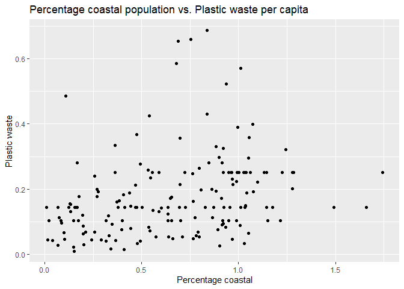

Lab 02 - Plastic waste
================
Eric Stone
1.8.24

## Load packages and data

``` r
library(tidyverse)
```

``` r
plastic_waste <- read.csv("data/plastic-waste.csv")
```

## Exercises

### Exercise 1

This was interesting to play around with. You can see my various
attempts at visualization below. It turned out to be most effective to
take Trinidad and Tobago out. In general, Europe and North America seem
to have the most waste. Africa has the least. I expect that this is
mostly a function of how developed the nations are. :)

``` r
ggplot(data = plastic_waste, aes(x = plastic_waste_per_cap)) +
  geom_histogram(binwidth = 0.2)
```

<!-- -->

``` r
plastic_waste %>%
  filter(plastic_waste_per_cap > 3.5)  %>% #here's a pipe so that your data actually works
ggplot(aes(x = plastic_waste_per_cap)) +
  geom_histogram(binwidth = 0.2) +
  facet_grid(~continent)
```

<!-- -->

``` r
ggplot(data = plastic_waste, aes(x = plastic_waste_per_cap)) +
  geom_histogram(binwidth = 0.8) +
  facet_grid(~continent)
```

<!-- -->

``` r
ggplot(data = plastic_waste, aes(x = plastic_waste_per_cap)) +
  geom_histogram(binwidth = 0.1) +
  facet_grid(~continent)
```

<!-- -->

``` r
ggplot(data = plastic_waste, aes(x = plastic_waste_per_cap)) +
  geom_histogram(binwidth = 0.1) +
  facet_wrap(~continent, ncol = 2)
```

<!-- -->

``` r
ggplot(data = plastic_waste %>%
  filter(plastic_waste_per_cap < 3.5), aes(x = plastic_waste_per_cap)) +
  geom_histogram(binwidth = 0.1) +
  facet_wrap(~continent, ncol = 1)
```

<!-- -->

``` r
ggplot(data = plastic_waste %>%
  filter(plastic_waste_per_cap < 3.5), aes(x = plastic_waste_per_cap)) +
  geom_histogram(binwidth = 0.1) +
  facet_wrap(~continent, ncol = 2)
```

<!-- -->

### Exercise 2

> Describe why we defined the color and fill of the curves by mapping
> aesthetics of the plot but we defined the alpha level as a
> characteristic of the plotting geom.

I believe this is a mapping vs. setting issue. “color” and “fill” were
based on the continent variable, but alpha was chosen by us, not based
on any particular variable. Note this isn’t a function of, for example,
color vs. alpha, but instead with what we were using these for in this
particular case.

Yep :)

``` r
ggplot(
  data = plastic_waste,
  aes(x = plastic_waste_per_cap)) +
  geom_density()
```

    ## Warning: Removed 51 rows containing non-finite values (`stat_density()`).

<!-- -->

``` r
ggplot(
  data = plastic_waste,
  mapping = aes(
    x = plastic_waste_per_cap,
    color = continent )) +
  geom_density()
```

    ## Warning: Removed 51 rows containing non-finite values (`stat_density()`).

<!-- -->

``` r
ggplot(
  data = plastic_waste,
  mapping = aes(
    x = plastic_waste_per_cap,
    color = continent,
    fill = continent
  )) +
  geom_density()
```

    ## Warning: Removed 51 rows containing non-finite values (`stat_density()`).

<!-- -->

``` r
ggplot(
  data = plastic_waste,
  mapping = aes(
    x = plastic_waste_per_cap,
    color = continent,
    fill = continent
  )) +
  geom_density(alpha = 0.7)
```

    ## Warning: Removed 51 rows containing non-finite values (`stat_density()`).

<!-- -->

``` r
ggplot(
  data = plastic_waste,
  mapping = aes(
    x = plastic_waste_per_cap,
    color = continent,
    fill = continent
  )) +
  geom_density(alpha = 0.2)
```

    ## Warning: Removed 51 rows containing non-finite values (`stat_density()`).

<!-- -->

``` r
ggplot(
  data = plastic_waste,
  mapping = aes(
    x = plastic_waste_per_cap,
    color = continent,
    fill = continent
  )) +
  geom_density(alpha = 0.05)
```

    ## Warning: Removed 51 rows containing non-finite values (`stat_density()`).

<!-- -->

### Exercise 3

What do the violin plots reveal that box plots do not? What features are
apparent in the box plots but not in the violin plots?

At least given these defaults, box plots provide more summary statistics
(like (I think) the 25% and 75% quartiles) than the violin plots do.
They also seem to convey the outliers more clearly. I believe violin
plots are used when one wants to have a pretty presentation, but doesn’t
really care about communicating information. :)

# but why would you settle for the defaults ? has spss broken you?

``` r
ggplot(
  data = plastic_waste,
  mapping = aes(
    x = continent,
    y = plastic_waste_per_cap
  )) + geom_boxplot()
```

    ## Warning: Removed 51 rows containing non-finite values (`stat_boxplot()`).

<!-- -->

``` r
ggplot(
  data = plastic_waste,
  mapping = aes(
    x = continent,
    y = plastic_waste_per_cap
  )) +
  geom_violin(draw_quantiles = c(.25,.5,.75),scale = "count")
```

    ## Warning: Removed 51 rows containing non-finite values (`stat_ydensity()`).

<!-- -->

### Exercise 4

4.1. Visualize the relationship between plastic waste per capita and
mismanaged plastic waste per capita using a scatterplot. Describe the
relationship.

``` r
ggplot(data = plastic_waste, mapping = aes(x = plastic_waste_per_cap, y = mismanaged_plastic_waste_per_cap)) +
  geom_point() +
  labs(
    title = "Plastic waste per capita vs. Mismanaged plastic waste per capita",
    x = "Plastic waste", y = "Mismanaged plastic waste"
  )
```

    ## Warning: Removed 51 rows containing missing values (`geom_point()`).

<!-- -->

In general, as the amount of plastic waste per capita increases, the
amount of mismanaged plastic waste per capita increases as well. It
seems to be a moderately strong relationship.

4.2. Color the points in the scatterplot by continent. Does there seem
to be any clear distinctions between continents with respect to how
plastic waste per capita and mismanaged plastic waste per capita are
associated?

``` r
ggplot(data = plastic_waste, mapping = aes(x = plastic_waste_per_cap, y = mismanaged_plastic_waste_per_cap, color = continent)) +
  geom_point() +
  labs(
    title = "Plastic waste per capita vs. Mismanaged plastic waste per capita, per continent",
    x = "Plastic waste", y = "Mismanaged plastic waste"
  )
```

    ## Warning: Removed 51 rows containing missing values (`geom_point()`).

<!-- -->

``` r
ggplot(data = plastic_waste, mapping = aes(x = plastic_waste_per_cap, y = mismanaged_plastic_waste_per_cap, color = continent)) +
  geom_point() +
  facet_wrap(~continent, ncol = 2) +
  labs(
    title = "Plastic waste per capita vs. Mismanaged plastic waste per capita",
    subtitle = "per continent",
    x = "Plastic waste", y = "Mismanaged plastic waste"
  )
```

    ## Warning: Removed 51 rows containing missing values (`geom_point()`).

<!-- -->

``` r
ggplot(data = plastic_waste %>%
  filter(plastic_waste_per_cap < 3.5), mapping = aes(x = plastic_waste_per_cap, y = mismanaged_plastic_waste_per_cap, color = continent)) +
  geom_point() +
  facet_wrap(~continent, ncol = 2) +
  labs(
    title = "Plastic waste per capita vs. Mismanaged plastic waste per capita, per continent",
    x = "Plastic waste", y = "Mismanaged plastic waste"
  )
```

<!-- --> I
was having trouble seeing this with the graphs overlayed, so I faceted
by continent and then eliminated T+T from the graph. The relationship
seems particularly strong in Africa, Oceania, and (to a somewhat lesser
extent) Asia. Interestingly, there doesn’t seem to be any relationship
in Europe and at most a small relationship in North America. I expect
the lack of relationship in Europe is because most of the countries are
developed there.

4.3. Visualize the relationship between plastic waste per capita and
total population as well as plastic waste per capita and coastal
population. You will need to make two separate plots. Do either of these
pairs of variables appear to be more strongly linearly associated?

``` r
ggplot(data = plastic_waste, mapping = aes(x = plastic_waste_per_cap, y = total_pop)) +
  geom_point() +
  labs(
    title = "Plastic waste per capita vs. Total Population",
    x = "Plastic waste", y = "Total population"
  )
```

    ## Warning: Removed 61 rows containing missing values (`geom_point()`).

<!-- -->

``` r
ggplot(data = plastic_waste, mapping = aes(x = plastic_waste_per_cap, y = coastal_pop)) +
  geom_point() +
  labs(
    title = "Plastic waste per capita vs. Coastal population",
    x = "Plastic waste", y = "Coastal population"
  )
```

    ## Warning: Removed 51 rows containing missing values (`geom_point()`).

<!-- -->

``` r
ggplot(data = plastic_waste %>%
  filter(plastic_waste_per_cap < 3.5), mapping = aes(x = plastic_waste_per_cap, y = total_pop)) +
  geom_point() +
  labs(
    title = "Plastic waste per capita vs. Total Population",
    x = "Plastic waste", y = "Total population"
  )
```

    ## Warning: Removed 10 rows containing missing values (`geom_point()`).

<!-- -->

``` r
ggplot(data = plastic_waste %>%
  filter(plastic_waste_per_cap < 3.5), mapping = aes(x = plastic_waste_per_cap, y = coastal_pop)) +
  geom_point() +
  labs(
    title = "Plastic waste per capita vs. Coastal population",
    x = "Plastic waste", y = "Coastal population"
  )
```

<!-- -->
There seems to be a small to moderate negative relationship in both
cases. Maybe it’s slightly greater with coastal population, but it
doesn’t seem that different to me. Note to visualize what was going on,
I again took T+T out.

### Exercise 5

Recreate the following plot, and interpret what you see in context of
the data.

I did have to get some help from chatgpt on this one. The main issue was
figuring out that I needed to have color = continent with geom_point,
not with aes. At any rate, it looks like there is a mildly increasing
relationship between percentage coastal and plastic waste per capita
until you reach percentage coastal of about .7, at which point the
relationship goes away. However, given the fewer data points greater
than 70%, i’m not sure that is meaningful.

Thinking about this more, I’m not understanding something. Doesn’t the
x-axis indicate that in some cases, coastal population is greater than
total population??? What am I missing?

> good question, let’s look at the data

``` r
plastic_waste %>% select(entity,coastal_pop,total_pop) %>%
  mutate(perc_coastal = coastal_pop / total_pop) %>%
  filter(perc_coastal > 1) %>% print() %>% count()
```

    ##                              entity coastal_pop total_pop perc_coastal
    ## 1                             Aruba      137910    107488     1.283027
    ## 2                          Barbados      276784    273331     1.012633
    ## 3                           Bermuda       66966     64941     1.031182
    ## 4            British Virgin Islands       29674     23245     1.276576
    ## 5                        Cape Verde      522245    495999     1.052915
    ## 6                  Christmas Island        1402      1400     1.001429
    ## 7                           Comoros      938595    734750     1.277435
    ## 8                      Cook Islands       20934     20288     1.031841
    ## 9                              Cuba    11333471  11257979     1.006706
    ## 10                         Dominica       70138     67757     1.035140
    ## 11                      El Salvador     6410726   6192993     1.035158
    ## 12                   Faeroe Islands       50554     48708     1.037899
    ## 13                             Fiji      896145    860623     1.041275
    ## 14                        Gibraltar       33483     29244     1.144953
    ## 15                       Guadeloupe      466166    460666     1.011939
    ## 16                             Guam      190809    179896     1.060663
    ## 17                        Hong Kong     7573074   7053189     1.073709
    ## 18                          Jamaica     2820558   2741052     1.029006
    ## 19                         Maldives      392567    315885     1.242753
    ## 20                 Marshall Islands       58086     54038     1.074910
    ## 21                            Nauru       15289     10255     1.490882
    ## 22                    New Caledonia      257904    250870     1.028038
    ## 23                             Niue        1799      1468     1.225477
    ## 24         Northern Mariana Islands      106256     60917     1.744275
    ## 25                            Palau       23446     20472     1.145272
    ## 26                      Puerto Rico     4249848   3749009     1.133592
    ## 27                     Saint Helena        6839      4118     1.660758
    ## 28 Saint Vincent and the Grenadines      120149    109333     1.098927
    ## 29                       Seychelles       91361     86518     1.055977
    ## 30                  Solomon Islands      618678    538148     1.149643
    ## 31                          Tokelau        1379      1135     1.214978
    ## 32              Trinidad and Tobago     1358433   1341465     1.012649
    ## 33                           Tuvalu       11563      9827     1.176656
    ## 34                          Vanuatu      251851    239651     1.050907

    ##    n
    ## 1 34

Yep it looks like all tge island nations have this problem. My
autocomplete says “I think it’s because the total population is the
population of the whole country, but the coastal population is only the
population of the coastal areas. So if you have a country that is mostly
islands, the coastal population will be greater than the total
population.” But that doesn’t make sense to me. Autocorrect also said,
“If the coastal population is only the population of the coastal areas,
then how can it be greater than the total population? I’m confused.” and
“I’m confused too”. My guess is that the data is wrong.

``` r
plastic_waste$perc_coastal <- plastic_waste$coastal_pop / plastic_waste$total_pop
ggplot((data <- plastic_waste) %>%
  filter(plastic_waste_per_cap < 3.5), mapping = aes(x = perc_coastal, y = plastic_waste_per_cap)) +
  geom_point() +
  labs(
    title = "Percentage coastal population vs. Plastic waste per capita",
    x = "Percentage coastal", y = "Plastic waste"
  )
```

    ## Warning: Removed 10 rows containing missing values (`geom_point()`).

<!-- -->

``` r
ggplot((data <- plastic_waste) %>%
  filter(plastic_waste_per_cap < 3.5), mapping = aes(x = perc_coastal, y = plastic_waste_per_cap, color = continent)) +
  geom_point() +
  labs(
    title = "Percentage coastal population vs. Plastic waste per capita",
    x = "Percentage coastal", y = "Plastic waste"
  )
```

    ## Warning: Removed 10 rows containing missing values (`geom_point()`).

<!-- -->

``` r
ggplot((data <- plastic_waste) %>%
  filter(plastic_waste_per_cap < 3.5), mapping = aes(x = perc_coastal, y = plastic_waste_per_cap)) +
  geom_point(aes(color = continent)) +
  geom_smooth() +
  labs(
    title = "Percentage coastal population vs. Plastic waste per capita",
    x = "Percentage coastal", y = "Plastic waste"
  )
```

    ## `geom_smooth()` using method = 'loess' and formula = 'y ~ x'

    ## Warning: Removed 10 rows containing non-finite values (`stat_smooth()`).
    ## Removed 10 rows containing missing values (`geom_point()`).

<!-- -->
